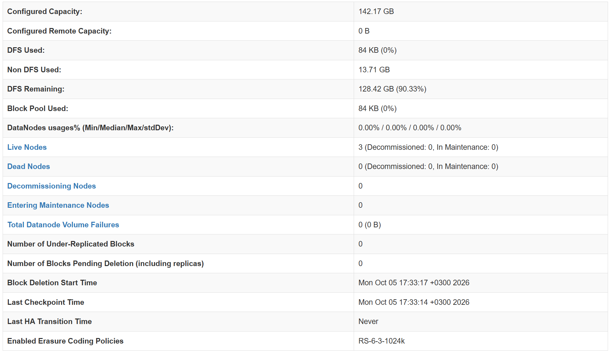
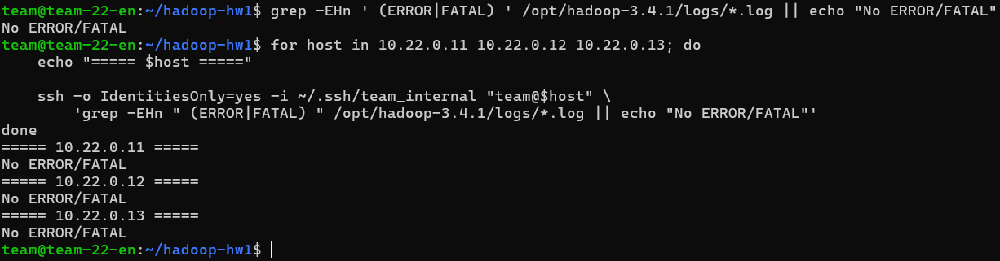

# Hadoop HDFS

## Архитектура

Используются 4 виртуальные машины:

| Host | IP | Роль |
|---|---|---|
| `team-22-en` | `10.22.0.10` | Edge, DataNode, SecondaryNameNode |
| `team-22-nn` | `10.22.0.11` | NameNode |
| `team-22-00` | `10.22.0.12` | DataNode |
| `team-22-01` | `10.22.0.13` | DataNode |

Изначально отдельные DataNode есть на:

```text
10.22.0.12
10.22.0.13
```

Для получения третьей DataNode используется edge-машина (т.к. изначально было выделено всего две):

```text
10.22.0.10
```

На ней же запускается SecondaryNameNode.

Итоговая схема:

```text
                  10.22.0.11
                    NameNode
                       |
          +------------+------------+
          |            |            |
          v            v            v
     10.22.0.10   10.22.0.12   10.22.0.13
       DataNode      DataNode      DataNode
          |
          +-- SecondaryNameNode
```

## Структура репозитория

```text
hadoop-hw1/
├── deploy.sh
├── reset.sh
├── README.md
└── config/
    ├── core-site.xml
    ├── hdfs-site.xml
    └── workers
```

### `core-site.xml`

Задает адрес NameNode:

```text
hdfs://10.22.0.11:9000
```

### `hdfs-site.xml`

Задает:

```text
NameNode data: /home/team/hadoop-data/namenode

DataNode data: /home/team/hadoop-data/datanode

SecondaryNameNode data: /home/team/hadoop-data/secondary

Replication factor: 3
```

SecondaryNameNode:

```text
10.22.0.10:9868
```

NameNode RPC bind:

```text
0.0.0.0
```

Это нужно, чтобы NameNode был доступен другим машинам кластера, а не только через loopback-интерфейс.

### `workers`

Список машин, на которых запускаются DataNode:

```text
10.22.0.10
10.22.0.12
10.22.0.13
```

---

# deploy.sh

`deploy.sh` запускается на edge-машине.

## 1. Основные переменные

В начале задаются:

```text
SSH key
Hadoop version
Hadoop directory
Hadoop download URL
IP удаленных машин
```

Для подключения с edge к остальным VM используется:

```text
~/.ssh/team_internal
```

## 2. Установка Java

На каждой машине проверяется наличие Java:

```bash
command -v java
```

Если Java отсутствует:

```bash
apt-get update
apt-get install openjdk-11-jdk
```

Если Java уже установлена, шаг пропускается.

## 3. Установка Hadoop

Проверяется наличие:

```text
/opt/hadoop-3.4.1/bin/hadoop
```

Если файла нет:

```text
скачивается Hadoop 3.4.1
архив распаковывается в /opt
архив удаляется
```

Проверка выполняется на всех четырех машинах.

## 4. Настройка JAVA_HOME

В:

```text
/opt/hadoop-3.4.1/etc/hadoop/hadoop-env.sh
```

задается:

```text
JAVA_HOME=/usr/lib/jvm/java-11-openjdk-amd64
```

Если значение уже существует, оно заменяется.

## 5. Копирование конфигурации

На edge файлы:

```text
core-site.xml
hdfs-site.xml
workers
```

копируются в:

```text
/opt/hadoop-3.4.1/etc/hadoop/
```

На остальные машины конфиги сначала передаются через `scp` во временную директорию, после чего через `sudo` копируются в директорию Hadoop.

## 6. Создание директорий HDFS

На NameNode:

```text
10.22.0.11
/home/team/hadoop-data/namenode
```

На DataNode:

```text
10.22.0.10
10.22.0.12
10.22.0.13
```

создается:

```text
/home/team/hadoop-data/datanode
```

На SecondaryNameNode:

```text
10.22.0.10
/home/team/hadoop-data/secondary
```

## 7. Форматирование NameNode

Перед форматированием проверяется:

```text
/home/team/hadoop-data/namenode/current/VERSION
```

Если файл есть:

```text
NameNode already formatted
```

и форматирование пропускается.

Если файла нет:

```bash
hdfs namenode -format -nonInteractive
```

Это позволяет повторно запускать `deploy.sh` без повторного форматирования HDFS.

## 8. Запуск HDFS

Запускаются следующие процессы:

```text
10.22.0.10
    DataNode
    SecondaryNameNode

10.22.0.11
    NameNode

10.22.0.12
    DataNode

10.22.0.13
    DataNode
```

Перед запуском каждого процесса через `jps` проверяется, не запущен ли он уже.

---

# reset.sh

`reset.sh` используется для полного удаления установленного кластера.

Перед выполнением требуется ввести RESET.

## 1. Остановка HDFS

Останавливаются:

```text
NameNode
SecondaryNameNode
3 DataNode
```

## 2. Удаление Hadoop

На всех машинах удаляется:

```text
/opt/hadoop-3.4.1
```

## 3. Удаление данных HDFS

На всех машинах удаляется:

```text
/home/team/hadoop-data
```

То есть удаляются:

```text
NameNode metadata
DataNode blocks
SecondaryNameNode checkpoints
```

## 4. Удаление логов и временных файлов

Удаляются:

```text
/home/team/hadoop-log-archive
/tmp/hadoop.tar.gz
```

## 5. Удаление Java

На всех машинах удаляются пакеты:

```text
openjdk-11-*
```

После этого выполняется:

```bash
apt-get autoremove
```

При этом не удаляются:

```text
Git-репозиторий
SSH-ключи
SSH-config
```

После `reset.sh` кластер можно заново поднять командой:

```bash
./deploy.sh
```

---

# Запуск

Перейти на edge:

```bash
cd ~/hadoop-hw1
```

Запустить:

```bash
./deploy.sh
```

Полностью удалить кластер:

```bash
./reset.sh
```

После reset снова развернуть:

```bash
./deploy.sh
```

---

# Проверка

## Процессы

На edge:

```bash
jps
```

Ожидается:

```text
DataNode
SecondaryNameNode
```

На `10.22.0.11`:

```text
NameNode
```

На `10.22.0.12`:

```text
DataNode
```

На `10.22.0.13`:

```text
DataNode
```

Проверка удаленных машин:

```bash
for host in 10.22.0.11 10.22.0.12 10.22.0.13; do
    echo "===== $host ====="
    ssh -o IdentitiesOnly=yes -i ~/.ssh/team_internal "team@$host" 'jps'
done
```

## Состояние DataNode

```bash
/opt/hadoop-3.4.1/bin/hdfs dfsadmin -report
```

Результат:

```text
Live datanodes (3)
Dead datanodes (0)
```

## Логи

Edge:

```bash
grep -EHn ' (ERROR|FATAL) ' /opt/hadoop-3.4.1/logs/*.log || echo "No ERROR/FATAL"
```

Остальные машины:

```bash
for host in 10.22.0.11 10.22.0.12 10.22.0.13; do
    echo "===== $host ====="

    ssh -o IdentitiesOnly=yes -i ~/.ssh/team_internal "team@$host" \
        'grep -EHn " (ERROR|FATAL) " /opt/hadoop-3.4.1/logs/*.log || echo "No ERROR/FATAL"'
done
```

После полного:

```bash
./reset.sh
./deploy.sh
```

на всех машинах:

```text
No ERROR/FATAL
```

## NameNode UI

NameNode UI:

```text
10.22.0.11:9870
```

Через SSH tunnel:

```bash
ssh -L 9870:10.22.0.11:9870 team@2.59.80.29
```

После этого:

```text
http://localhost:9870
```

Получено:

```text
Live Nodes: 3
Dead Nodes: 0
Total Datanode Volume Failures: 0
```

---

# Результат

После полного удаления:

```bash
./reset.sh
```

и повторного запуска:

```bash
./deploy.sh
```

получено:

```text
1 NameNode
1 SecondaryNameNode
3 Live DataNode
0 Dead DataNode
0 DataNode Volume Failures
0 ERROR/FATAL в свежих логах
```

Скриншот NameNode UI:



Скриншот проверки логов:



